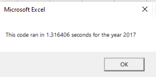
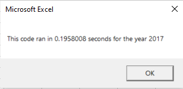
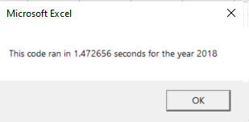
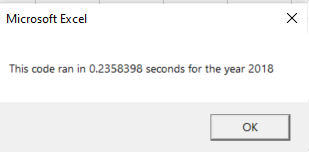

# Stock Analysis with VBA

## Overview of Project

### Background

VBA is often used in the financial industry, so the the project refers to stock data. Steve is requiring a report to analyze  an entire dataset for years 2017 and 2018 to be delivered to his parents. After the analysis of the ticker "DQ", more research is required for his parents to expand the dataset and include the entire stock market over the last few years (2017, 2018). 

### Purpose

The main purpose of this project is to refactor the current code developed in the Module 2 in order to reduce the time to execute the analysis over the list of tickers. For this, it is required to collect the same information about Total Daily Volume and % Return by Ticker for 2017 and 2018 utilizing an standard formatiing and identify if refactoring a code succesfully made VBA run faster.

## Results
To develop the new Refactored Code, a new module was created called "All Stock Analysis Factored" with a variables startTime and endTime as single to measure the performance of the new code. Additionally, a "yearValue" variable was created using a InputBox to store the specific year from the data will be pull as yearValue = InputBox("What year would you like to run the analysis on?")

Then a formatting of the output sheet was created activating the specific sheet considering assigment of value for specific year and the header of the first rows with the "Ticker", "Total Daily Volume" and "Return" with the command cells.value as the expample shows: Cells(3, 2).Value = "Total Daily Volume" 

The next steps were related with the creation of an array for the tickers. A total of 12 tickers were defined considering the stock code provided in the data for the analysis, where the first value "AY" was assigned to the first position (tickers(0) = "AY"), "CSIQ" for the next one (tickers(1) = "CSIQ").... up to the 12 position with tickers(11) = "VSLR".

Then, the activation of the specific worksheet year was created considering the input established in the InputBox with the code Worksheets(yearValue).Activate to run the analysis. The first step after this was obtained the number of rows to loop over, using this as a reference for the analysis over the data, since each year (2017, 2018) has different total rows, and also meaning an advantage if more data is added to the list. This was possible using the code RowCount = Cells(Rows.Count, "A").End(xlUp).Row.

Next steps include the creation do the ticker Index, which was a key in the refactoring process and the base to reduce significantly the processing time. This variable was declared as an Integer with value equal to zero and it is the main difference compared to the original code where a loop for the ticker and a loop for the rows was developed one into the other.

The output obtain from the analysis includes tickerVolume, startPrice and endingPrice. For tickerVolume, the calculation is made witht the following code tickerVolumes(tickerIndex) = tickerVolumes(tickerIndex) + Cells(Row, 8).Value into a loop for row 2 (first row to analyze) up to the last row with data. In this formula, the tickerVolume variable is adding the volume for the specific row to the previous value stored in order to have the volume for each ticker. It is important note that tickerVolume is equal to zero for each new ticker identified in the row analysis and the value is assigned to an array (for example first row for "AY" stocks will have a total value in tickerVolumes(0) , etc). Ex:

Create a for loop to initialize the tickerVolumes to zero.
    For i = 0 To 11
    tickerVolumes(i) = 0
    Next i

Then, a verification was made to determine if the current row in the loop is the first row with the selected tickerIndex. A code was created under If-Then to verify is the current ticker value (already storage in the array by each positon) is different to the value corresponding to the previous row (Row-1) for all Rows from 2 to RowCount (Last row already calculated previously in part 2b). If the condition applies, then a value will be storage in a variable count tickerStartinPrices storage into an array where the index is related again with the variable tickerIndex as follow: 

        '3b) Check if the current row is the first row with the selected tickerIndex.
         If tickers(tickerIndex) <> Cells(Row - 1, 1).Value Then
         'store the starting price
         tickerStartingPrices(tickerIndex) = Cells(Row, 6).Value

Similar with the ending price, where the analysis of the condition "If" was created compare to the next row to verify if there was a difference to the tickers storage in the array, using the code as follow:

        '3c) check if the current row is the last row with the selected ticker
         'If the next row’s ticker doesn’t match, increase the tickerIndex.
         If tickers(tickerIndex) <> Cells(Row + 1, 1).Value Then
         'store the closing price
         tickerEndingPrices(tickerIndex) = Cells(Row, 6).Value

The calculation for these both variable (startingPrice and endingPrice) are another difference compared with the Original VBA script where the results of the started and ending price was transfer directly to the output sheet within the same outter loop before going to the next iteration, generating an increment in the processing time.         
         
Further, an increment in the tickerIndex was created using the code tickerIndex = tickerIndex + 1 before itirate to the next row number in order to analyze the next set of data using under the new arrays that depend of the ticker index in the code. This step is the main difference and the key to obtained a considerable reduction in the processing time. 

Finally, the output process and the formatting between the original code and the Refactored Code was create in the same way, utilizing cells.value in a loop and calculating the Volume Change as the difference between endingPrice and startingPrice in percentage as follows:

        '4) Loop through your arrays to output the Ticker, Total Daily Volume, and Return.
           
        Worksheets("All Stocks Analysis").Activate
        Range("A4:C15").ClearContents
        For i = 0 To 11
            Cells(i + 4, 1).Value = tickers(i)
            Cells(i + 4, 2).Value = tickerVolumes(i)
            Cells(i + 4, 3).Value = tickerEndingPrices(i) / tickerStartingPrices(i) - 1
      
        Next i
    
        'Formatting
        Worksheets("All Stocks Analysis").Activate
        Range("A3:C3").Font.FontStyle = "Bold"
        Range("A3:C3").Borders(xlEdgeBottom).LineStyle = xlContinuous
        Range("B4:B15").NumberFormat = "#,##0"
        Range("C4:C15").NumberFormat = "0.0%"
        Columns("B").AutoFit

        dataRowStart = 4
        dataRowEnd = 15

        For i = dataRowStart To dataRowEnd
        
            If Cells(i, 3) > 0 Then
            Cells(i, 3).Interior.Color = vbGreen
            Else
            Cells(i, 3).Interior.Color = vbRed
            
        End If
        
        Next i
       
In order to evaluate the speed to run the code, the endTime variable was captured in similar way for both (original and refactored codes) utilizing a MsgBox as:

endTime = Timer
MsgBox "This code ran in " & (endTime - startTime) & " seconds for the year " & (yearValue)

In the following image it is possible verify the time for the Original and Refactored code for each year after related the macros to specific buttoms for the this analysis:

Original 2017

Refactored 2017

Original 2018

Refactored 2018

For 2017 there is a reduction of  85.13% from 1.316406 to 0.1958008 secs, while for 2018 there is a reduction of  83.4% from 1.472656 to 0.2358398 secs confirming that refactoring a code represent an advantage to optimize the analisys of the data in a more efficient way, preventing also "Code Smells" or bad practices that could lead to a deeper problem that could created poor readibility, longer debugging time and difficult to mantain the project for longer time.

## Summary

### What are the advantages or disadvantages of refactoring code?
The main advantage of refactoring a code include the reduction in the processing time in VBA. As it was possible observed in the excercise, an average reduction of 84.3% in the processing time was achieved just refactoring the original code utilizing arrays based on hte tickerIndex. This is significant important while the analysis is applied to big data set; making the code more efficient by taking fewers steps to perform the run and find a better way to accomplish a task with less complexity. Also, after refactoring, the code is fresher, easier to understand or read, less complex and easier to maintain. On the other side, some disadvantages include the time consuming were may have no idea how much time it may take to complete the process. It may also land into a situation where the developer have no idea where to go because  the structure of the code developed by others. 

### How do these pros and cons apply to refactoring the original VBA script?
Code Refactoring was a way of restructuring and optimizing existing code without changing its behavior. Refactoring the original VBA script helped to understand the structure of utilize and index inside multiple arrays based on the tickerIndex, in this way it was found that code was used by more than one code path and instead of copy and paste similar codes, an tickerIndex was implemented to maximize the array tool for the analysis; while the complexity of the Original VBA script was reduce significantly having an improved code, with better readibility and more efficient execution time (with almost 85% of improvement for the data set used in the challenge). Some cons applies based on the impact in the deadline to deliver the final product, since developing the refactoring could involve more time consuming to end the code compare with the original VBA script, also, a the potential generation of bug during the change of the code which required more time to fix the final refactored code and have a satisfied run of the VBA Script. 
